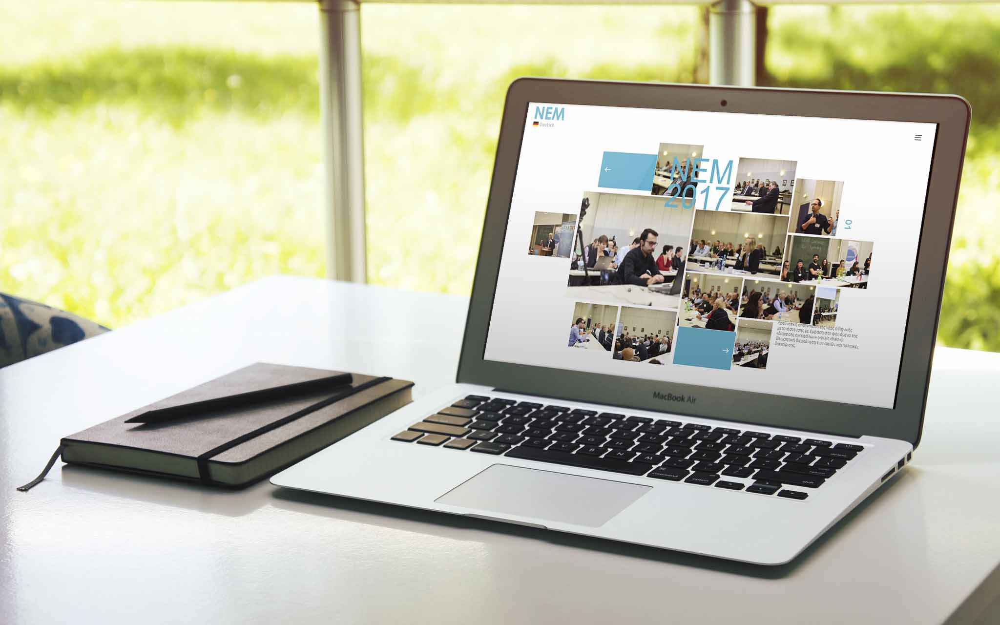
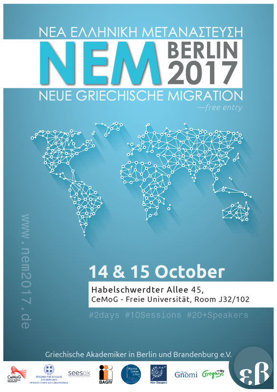
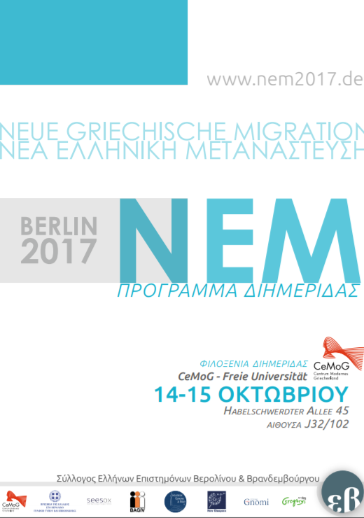
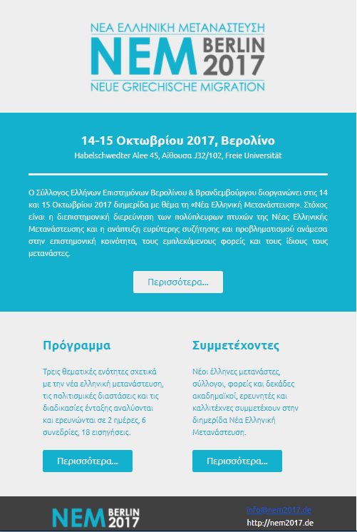

NEM (Νέα Ελληνική Μετανάστευση - New Greek Migration) was a conference organized by the [Society of Greek Scientists in Berlin & Brandeburg](http://gr-akademiker-berlin.de/) in October 2017. 

**URL:**http://nem2017.de/  
**Compatibility:**All modern browsers (IE10+).   

## Service
- Branding, content strategy, website design, development and deployment. 
- Google analytics setup, management and reporting (google data studio). 
- Email-design (mjml) and marketing (mailchimp).  
- Typeform integration, form analytics and reports.
- Posters (A2,rollup), flyers (A6) design. Program and guides (brochures) design.  

<dl>  </dl>

*Graphic design(Adobe Illustrator) and e-mail design (MJML) samples:*

  
  

  

